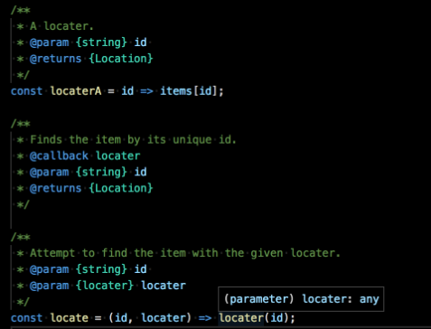

# {{ $frontmatter.title }}
JSDoc 是适用于 JavaScript 的 API 文档生成工具,可以识别特定的标记语法编写的注释来生成可读性较好的文档



## VS Code 对 JSDoc 的支持

VS Code 能够理解大部分的 JSDoc 注释并且能够根据这些注释提供智能补全的功能。你甚至可以利用 JSDoc 提供的类型信息对你的 JS 进行类型检查


## JSDoc 使用

1. @type
   使用@type 标签来引用一个类型名(原始类型/TypeScript 中定义的类型/或者"@typedef"标签)

    ```js
    /**
     * @type {string | number} 联合类型
     */
    var s;

    /** @type {Window} dom提供的类型 */
    var win;

    /** @type {Array<number>} 数组*/
    var nums;

    /** @type {{ a: string, b: number }} 复杂类型 */
    var var9;
    ```

2. @param @returns

    @param 使用和@type 相同的语法,但是需要添加参数名。将参数声明在中括号中可以使参数作为可选参数。使用@returns 来声明函数返回的类型

    ```js
    // 参数可以用多种语法来声明
    /**
     * @param {string}  p1 - 字符串参数
     * @param {string=} p2 - 可选参数(Closure syntax)
     * @param {string} [p3] - 另一个可选参数 (JSDoc syntax).
     * @param {string} [p4="test"] - 有默认值的可选参数
     * @return {string} 返回值
     */
    function stringsStringStrings(p1, p2, p3, p4) {
        return 'string';
    }
    ```

3. @typedef @callback @param
   @typedef 可以用来定义更复杂的类型。语法和@param 类似

    ```js
    /**
     * @typedef {object} SpecialType1 - 创建新的类型并命名为 'SpecialType'
     * @property {string} prop1 - SpecialType的字符串属性
     * @property {number} prop2 - SpecialType的数字属性
     * @property {number=} prop3 - SpecialType的可选数字属性
     */

    /** @type {SpecialType1} */
    var specialTypeObject1;
    ```

    @param 可以使用类似的语法来定义一次性使用的类型。与@typedef 不同的是嵌套属性名必须以参数名作为前缀

    ```js
    /**
     * @param {Object} options - The shape is the same as SpecialType above
     * @param {string} options.prop1
     * @param {number} options.prop2
     * @param {number=} options.prop3
     * @param {number} [options.prop4]
     * @param {number} [options.prop5=42]
     */
    function special(options) {
        return (options.prop4 || 1001) + options.prop5;
    }
    ```

    @callback 和@typedef 类似,但是它是定义函数类型而不是对象类型

    ```js
    /**
     * @callback Predicate
     * @param {string} data
     * @param {number} [index]
     * @returns {boolean}
     */

    /** @type {Predicate} */
    const ok = (s) => !(s.length % 2);
    ```

    当然,这些类型都可以在单行@typedef 中使用 TypeScript 语法来声明

    ```js
    /** @typedef {{ prop1: string, prop2: string, prop3?: number }} SpecialType */
    /** @typedef {(data: string, index?: number) => boolean} Predicate */
    ```

4. @ts-check

    说到底,JSDoc 只是更友好的类型提示工具，并不会对类型进行检查。VS Code 针对 TS 有类型检查,但是这对 JS 文件默认是不启用的。可以在 JS 文件第一行添加//@ts-check 开启类型错误提示
  

## 参考

-   [JSDoc 官网](https://jsdoc.app/)
-   [VS Code 对 JSDoc 的支持](https://code.visualstudio.com/docs/languages/javascript#_jsdoc-support)
-   [TypeScript 官网的 JSDoc 支持文档](https://www.typescriptlang.org/docs/handbook/jsdoc-supported-types.html)

