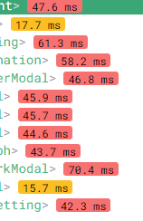

# {{ $frontmatter.title }}

不同的 tab 页使用的还是同一个组件，但是在 tab 点击到列表完全展示，差不多有 1s~2s 等待时间。原因可能是组件加载缓慢或者网络请求慢

### 组件加载

使用 Vue devtool 可以检查组件的加载时间

logContent 是列表组件容器，卡顿的表现也主要是由于该组件中的列表上时间没有渲染到页面，从而造成了视觉上的卡顿。从上图可以看出这个组件并没有耗费太长的时间。

### 接口请求

因为页面上有许多组件都可以和列表有交互,所以将数据的请求放在 Vuex 的 actions 中，可以更方便的在不同的组件中共享状态和操作。
整个列表加载是由三个接口构成

以下接口均为最近 5 分钟的查询结果 从上到下依次是三个接口的加载时间
切换第一个 tab 时

三次接口查询分别耗时 613ms 607ms 39ms
切换第二个 tab 时

三个接口总共耗时 802ms 831ms 790ms

访问上海的数据中心时平均耗时接近 1s，接近肉眼观察的页面加载时间

### 页面体验优化

加载动画在列表接口请求结束后就消失了，列表加载卡顿的原因也主要来自于 loading 动画结束之后到列表加载出来后的这一空白时间。loading 动画应该在第一个接口之前开始，在最后一个接口之后结束。
通过手动延长加载时间后，发现 loading 动画消失后到页面列表加载出来的这段时间，也是由 loading 组件占据了列表的位置，只是没有显示加载动画。

loading 状态由 noData 和 isLoadding 两个变量控制，当列表请求结束后，便设置了 noData 变量，而 isLoadding 变量还是 true，从而导致了动画结束后的空白时间。
至此，问题也解决了，去掉组件的 show-img 属性，将 setListLoadding 提前，便可以使动画正常结束。

### 组件加载顺序

在调试的过程中发现，初次进入原始日志页面的时候，表头的数据加载晚于列表的数据的加载。在 Vue 中，子组件的 created 生命周期先于父组件的 created 生命周期完成。获取日志的方法在子组件 searchbox 中调用，而获取表头的接口则在父组件中调用。因此，获取表头的方法永远晚于获取日志的接口，从而导致了表头的闪烁。这个问题可以通过将列表数据的请求放在父组件中来解决
