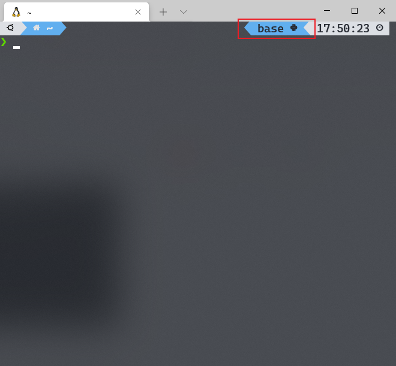

# {{ $frontmatter.title }}

在使用Node.js时候,我们可以使用nvm管理不同的Node.js版本.在维护老项目的时候,可以将Node.js切换到较低的版本;当需要新的JS特性的时候,可以将JS切换到较新的版本.

在使用python的时候,并没有像nvm这样的方便切换不同python版本的工具.虽然有virtualenv这样的虚拟环境管理软件,但是这类软件只是为当前python环境添加了一些特定的软件包,类似于node_modules,并不能切换python的版本,直到我发现了miniconda.

anaconda可以用来管理不同的Python,Node.js等等，而miniconda是anaconda的最小安装包，只包含必要的库。

## 安装
从[官网](https://docs.conda.io/en/latest/miniconda.html)下载自己电脑对应的安装包.在windows上，可以使用WSL作为日常的开发环境.
```bash
curl -sL \
  "https://repo.anaconda.com/miniconda/Miniconda3-latest-Linux-x86_64.sh" > \
  "Miniconda3.sh"
```
下载好之后,输入
```bash
bash Miniconda3.sh
```
依据提示安装

安装好之后重启终端，在终端的提示符上可以看到miniconda为我们默认激活了名为base的默认版本


## Python版本切换

### 安装其他版本的Python
```bash
conda create -n py36 python=3.6
```
3.6是你想要安装的Python版本号，-n参数用来设置版本的名字

### 激活特定版本
```bash
conda activate py36
```

### 停用当前激活的Python版本
```bash
conda deactivate
```

更多使用方法请参考[官网文档](https://docs.conda.io/en/latest/miniconda.html)
